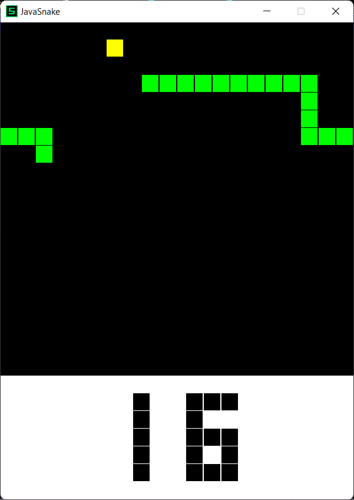
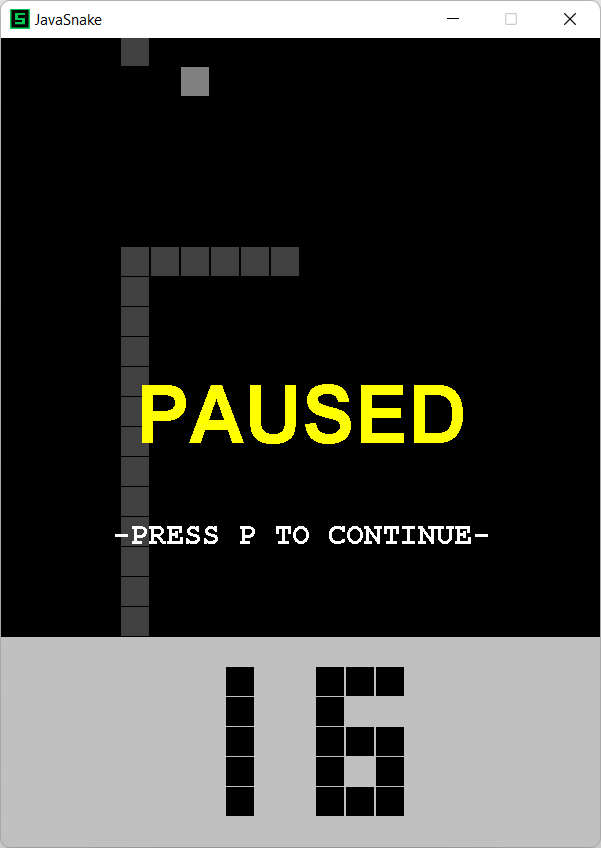
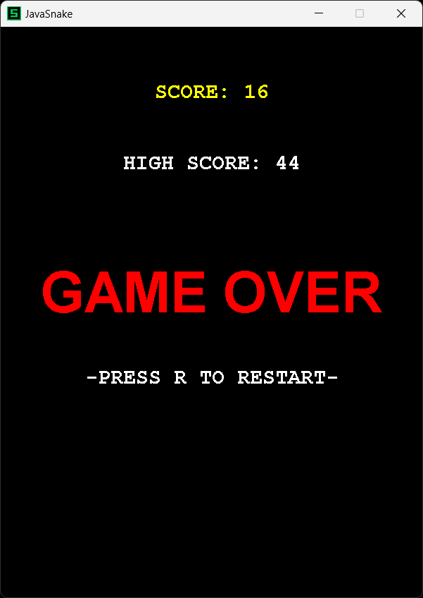

# JavaSnake

A small **Snake** game for the desktop, built with **Java Swing**.

## Requirements

- **JDK 21** (or newer compatible release)
- **Apache Maven 3.9+** (for the recommended build)

Check your environment:

```bash
java -version
javac -version
mvn -version
```

## Build and run

From the repository root:

```bash
mvn
```

This runs the project’s default goal: **compile**, then **start the game**.  
Equivalent explicit command:

```bash
mvn compile exec:java
```

**Note:** `mvn exec:java` alone can fail with `ClassNotFoundException` if the project has not been compiled yet—always include `compile` first, or use `mvn` as above.

Run unit tests:

```bash
mvn test
```

### Without Maven

If you only have the JDK, compile every `.java` file under `src/main/java`, then run `Game`:

**macOS / Linux (shell expands the glob):**

```bash
javac -d out -encoding UTF-8 src/main/java/*.java
java -cp out Game
```

**Windows (PowerShell):**

```powershell
javac -d out -encoding UTF-8 (Get-ChildItem -Path src\main\java\*.java).FullName
java -cp out Game
```

The window icon loads from the classpath when run via Maven; with plain `javac`/`java`, the app falls back to `src/main/resources/images/icon.png` on disk.

## Controls

| Action | Keys |
|--------|------|
| Move | **W A S D** or **arrow keys** |
| Pause / resume | **P** |
| Restart (after game over) | **R** |
| Quit | **Esc** |

## Screenshots

### Gameplay

(WASD or arrow keys to move.)



### Pause menu

(**P** to pause or resume.)



### Game over

(**R** to restart, **Esc** to close.)



## High score

The best score is stored in **`highscore.txt`** in the process **working directory** (usually the folder you run the game from). That file is ignored by Git (see `.gitignore`).

## License

See [LICENSE](LICENSE).
